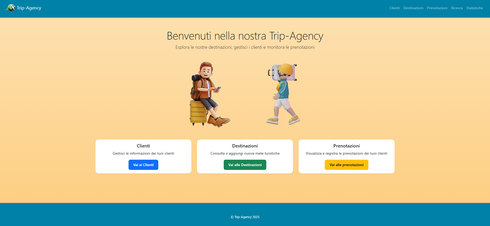
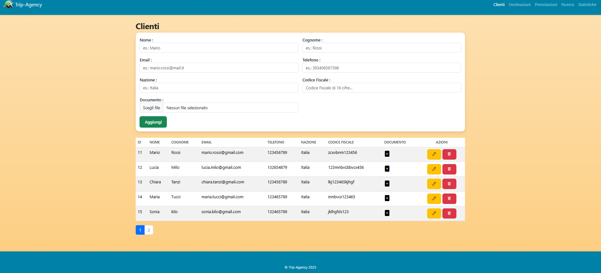
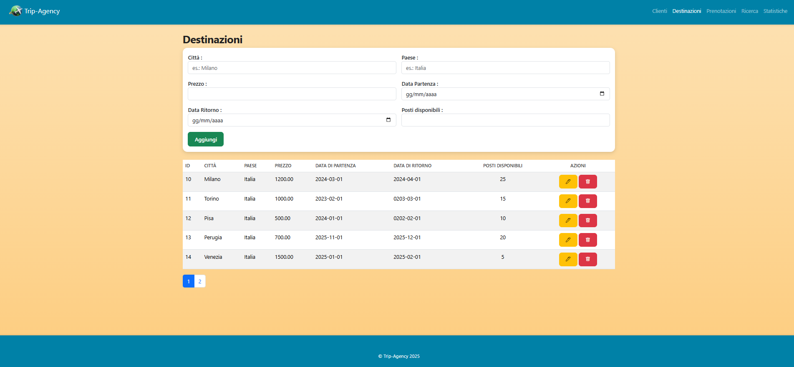
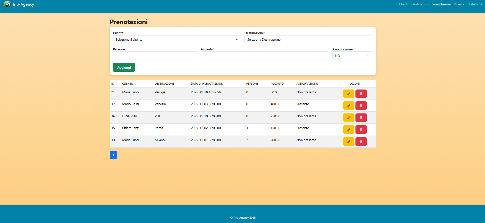
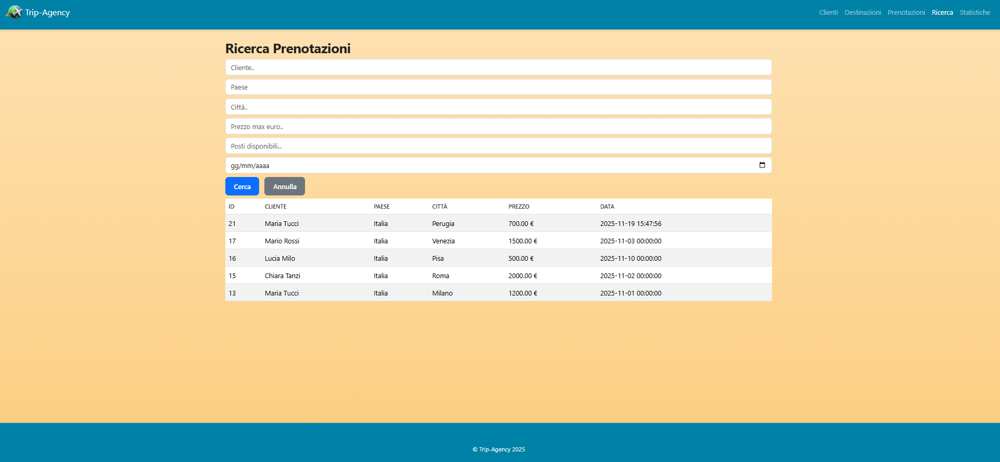
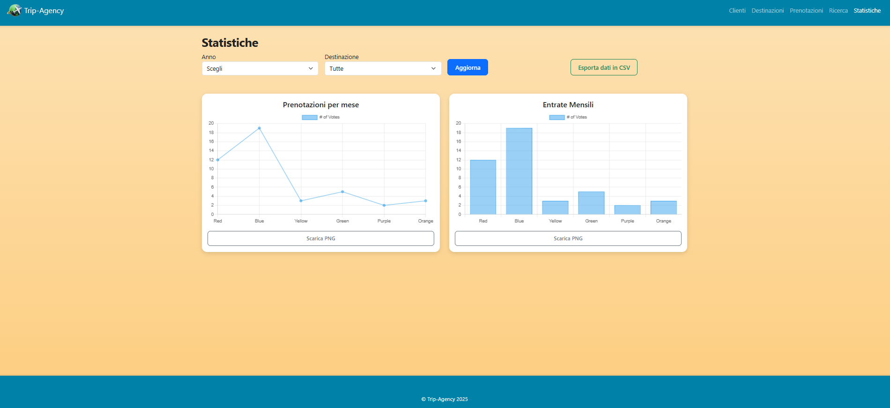

# ✈️ Trip-Agency 

##  Gestione Clienti, Destinazioni e Prenotazioni

### Web App sviluppata in PHP, MySQL e Bootstrap per la gestione di un’agenzia di viaggi.

*Progetto realizzato durante il Corso Full Stack – Novembre 2025.* 

---

### Descrizione del progetto

Trip-Agency è una web application progettata per gestire le principali attività di un’agenzia di viaggi.:

- Gestire i Clienti 

- Gestire le Destinazioni

- Registrare e consultare le Prenotazioni

- Creare relazioni tra clienti, destinazioni e prenotazioni tramite database MySQL

- Utilizzare un’interfaccia semplice e responsive grazie a Bootstrap

Il progetto è pensato per mostrare competenze full-stack e l’uso integrato di PHP + Database.

---

### Screenshot dell’applicazione

---

### Tecnologie Utilizzate
Backend

- PHP 8

- MySQL 

### Frontend

- HTML5

- CSS3

- Bootstrap 5

### Ambiente di sviluppo

- XAMPP (Apache + MySQL)

- Visual Studio Code

- GitHub

---

Autrice
Chiara Tanzi

